Bowling Companion (5-Pin Bowling Stats)
=======================================
An Android app to track 5-pin bowling statistics. Allows users to track multiple bowlers and leagues, and provides in-depth statistics on their game. Useful for determining areas in which the user's performance can be improved.

Screenshots from March 2015 Redesign
------------------------------------
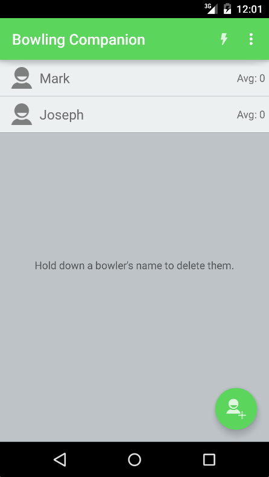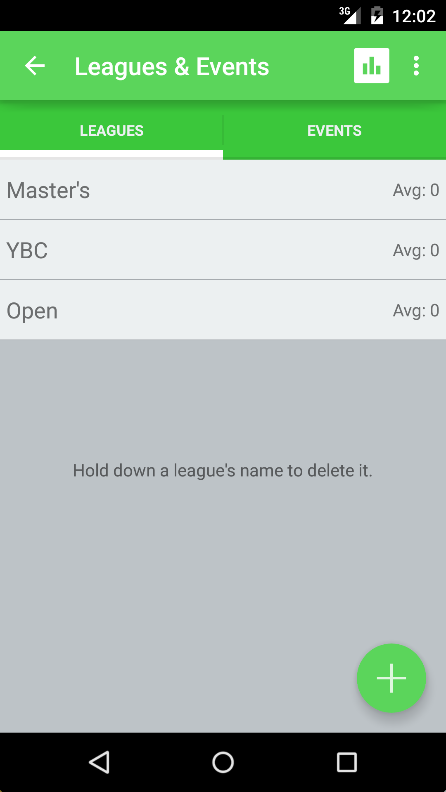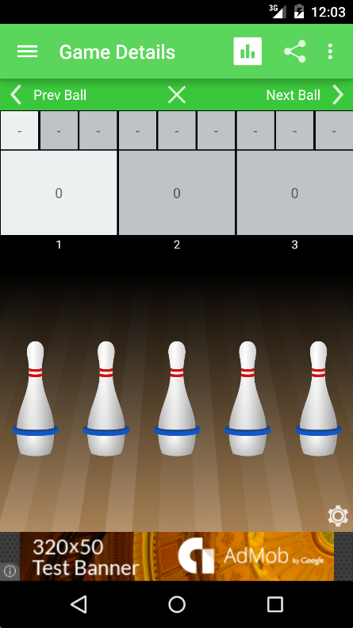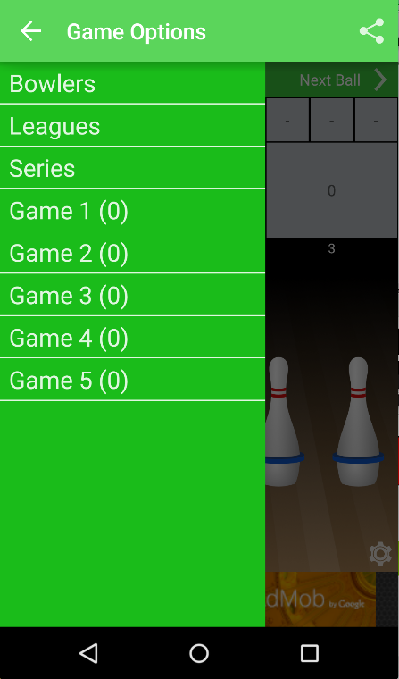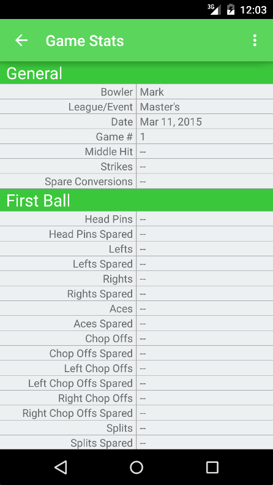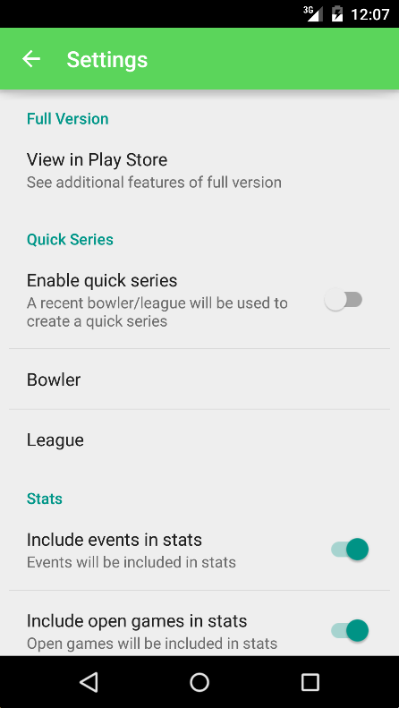 

Screenshots from CUSEC 2015 prototype
-------------------------------------
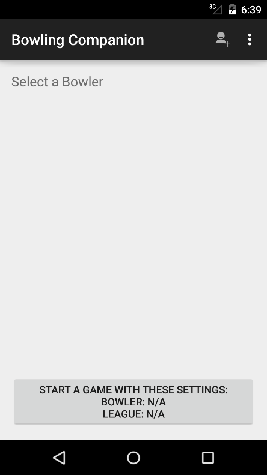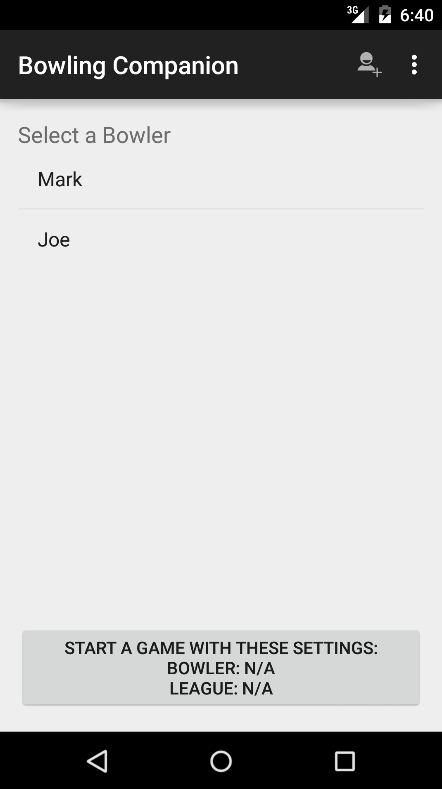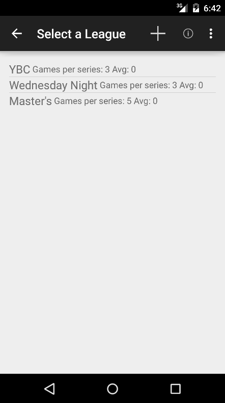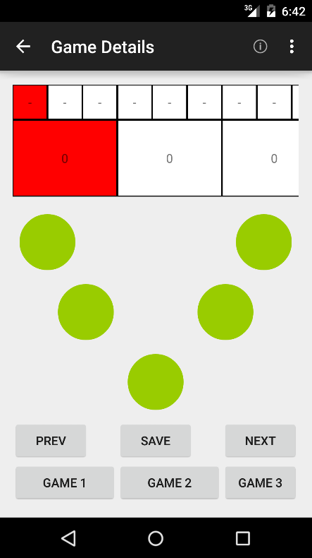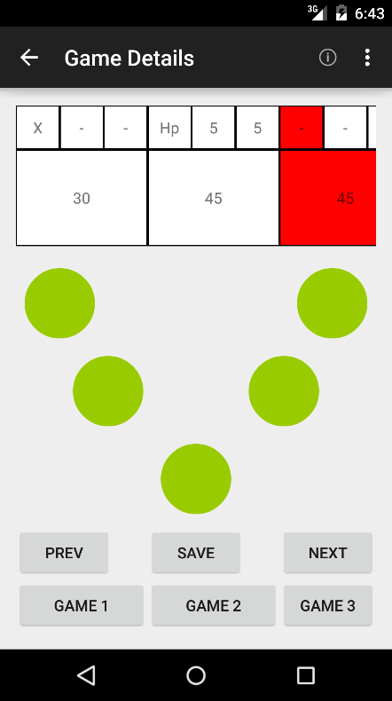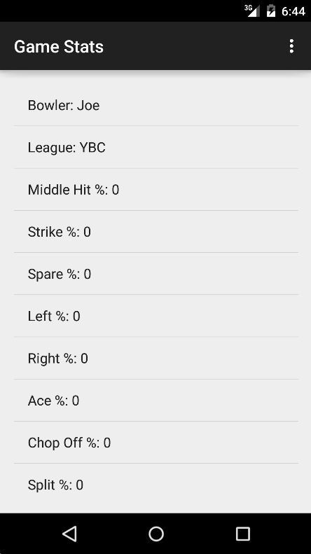 
