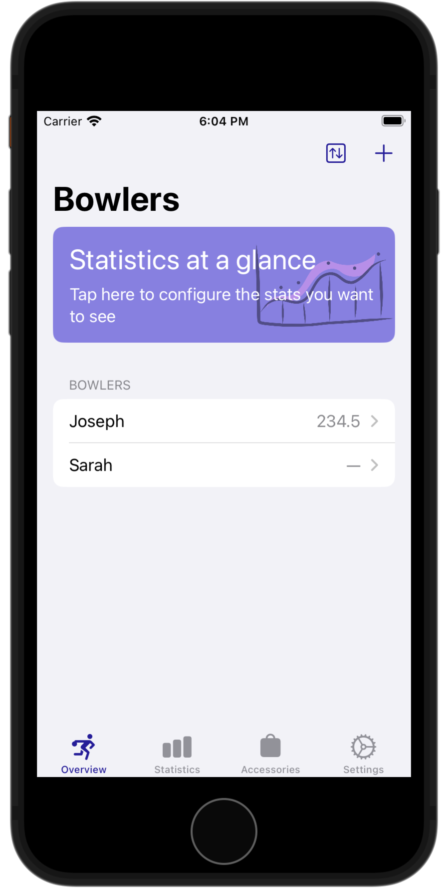

# Approach — the 5 Pin Bowling Companion

Approach is the 5 Pin Bowling Companion, built for Android and iOS with native platform technologies, Compose and SwiftUI. Approach allows users to track multiple bowlers and leagues, providing in-depth statistics on their game. Find areas for improvement and become better attuned to your own bowling style.

## Android

For details on building and running the Android app, check the [Android README](./android/README.md)

## iOS

For details on building and running the iOS app, check the [iOS README](./ios/README.md)

## Screenshots

| Feature | Android                                                                                                                                                                                                                                                                                                  | iOS                                                                                                                                                                                                                                                                                                                                                                                                                        |
| ------- | -------------------------------------------------------------------------------------------------------------------------------------------------------------------------------------------------------------------------------------------------------------------------------------------------------- | -------------------------------------------------------------------------------------------------------------------------------------------------------------------------------------------------------------------------------------------------------------------------------------------------------------------------------------------------------------------------------------------------------------------------- |
| Bowlers |                                                                         |                                                                                                                                                                                                                 |
| Editor  |  |  |
