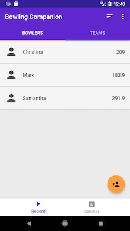
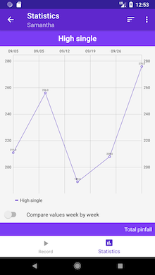

# Bowling Companion (5 Pin Bowling Statistics)

An Android app to track 5-pin bowling statistics. Allows users to track multiple bowlers and leagues, and provides in-depth statistics on their game. Useful for determining areas in which the user's performance can be improved.

[View it on the Play Store](https://play.google.com/store/apps/details?id=ca.josephroque.bowlingcompanion)

## How to Run

1. Clone project `git clone https://github.com/autoreleasefool/approach.git`
2. Import the project into Android Studio.

## Screenshots

| List of Bowlers                                     | Editor                                             | Statistics                                |
| --------------------------------------------------- | -------------------------------------------------- | ----------------------------------------- |
|  |  |  |
