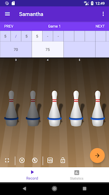

# Bowling Companion (5 Pin Bowling Statistics)

An Android app to track 5-pin bowling statistics. Allows users to track multiple bowlers and leagues, and provides in-depth statistics on their game. Useful for determining areas in which the user's performance can be improved.

[View it on the Play Store](https://play.google.com/store/apps/details?id=ca.josephroque.bowlingcompanion)

## Play Store Description

Your 5 Pin Bowling Companion is here!

Use this app to track scores of all your games frame-by-frame and view detailed statistics about every bowler, league, series or game that you include! With options to add special one-time events and tournaments, or a new series to a league each and every week, you'll be able to track everything that helps you succeed as a bowler. Use these statistics to improve your 5 pin game over the course of the season.

With a variety of themes and options to customize the statistics you see, you'll have all the tools you need to begin improving your bowling technique with this 5 pin bowling score keeper.

And the best part? Never pay a cent. This app will never offer you in-app purchases or become a paid service.

This app is also open source. Feel free to check out the repository at https://github.com/autoreleasefool/bowling-companion to see the source and even contribute. In addition, as you request and I plan new features, you'll be able to view their progress any time, so long as you understand what you're doing over at GitHub.

=================================

### Permissions

**Writing to external storage** - When you create an image of a series, this image must be saved somewhere on the device in order to allow you to share it.

## How to Run

1. Clone project `git clone https://github.com/autoreleasefool/bowling-companion.git`
2. Import the project into Android Studio.

## Screenshots

| List of Bowlers                                    | Editor                                            | Statistics                               |
| -------------------------------------------------- | ------------------------------------------------- | ---------------------------------------- |
|  |  |  |
